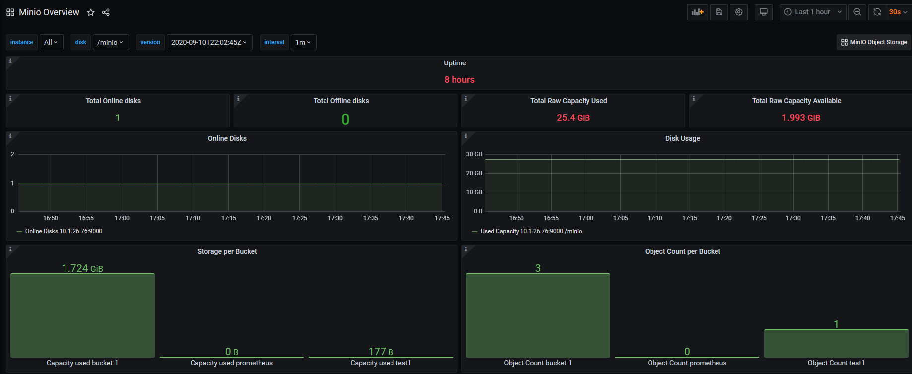
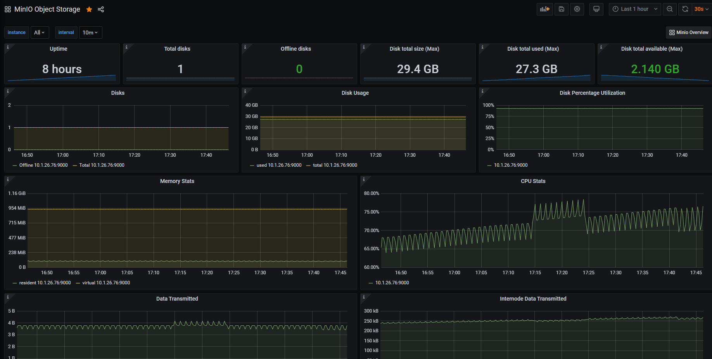
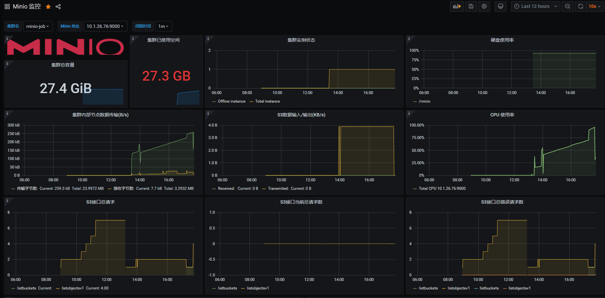

## minio [官方中文文档](https://docs.minio.io/cn/)

## 文件结构
```
minio-linux                                 
├── cluster                            # 集群
│   ├── docker-compose.yml               # 单主机集群方式，可用于测试
│   └── nginx.conf                       # nginx配置文件
└── single                             # 单节点
    ├── docker-compose.yml               # Docker部署方式
    └── minio.sh                         # Shell脚本方式
```

## 使用prometheus监控minio
[官方文档](https://docs.minio.io/docs/how-to-monitor-minio-using-prometheus.html)

- 1.为Prometheus指标配置身份验证类型
MinIO支持Prometheus `jwt`或两种身份验证模式`public`，默认情况下，MinIO在`jwt`模式下运行。要允许对普罗米修斯度量标准不进行身份验证就可以进行公共访问，请按如下所示设置环境。
```
export MINIO_PROMETHEUS_AUTH_TYPE="public"
```
配置之后重启minio服务

- 2.配置Public Prometheus:
```
  - job_name: minio-job
    metrics_path: /minio/prometheus/metrics
    scheme: http
    static_configs:
    - targets: ['<minio_server>:9000']
```
配置之后重启Prometheus

详细操作步骤和性能参数介绍请参看官方教程:[how-to-monitor-minio-using-prometheus](https://docs.minio.io/docs/how-to-monitor-minio-using-prometheus.html)

- 3.Grafana添加监控模板
个人推荐官方模板，分别为(部分模板无数据需要根据性能指标修改)：

[Minio Overview-12617](https://grafana.com/grafana/dashboards/12617)



[MinIO Object Storage-12563](https://grafana.com/grafana/dashboards/12563/reviews)



[Minio 监控-12063](https://grafana.com/grafana/dashboards/12063)


